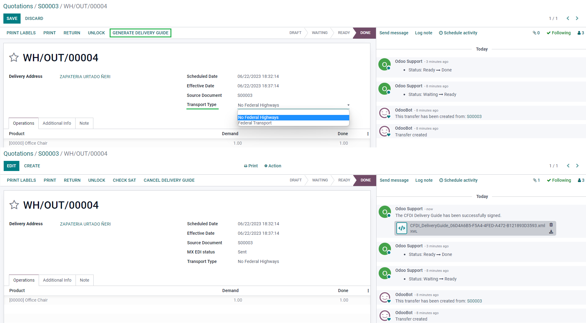

======
Mexico
======

Webinars
========

Below you can find videos with a general description of the localization, and how to configure it.

- `VIDEO WEBINAR OF A COMPLETE DEMO <https://www.youtube.com/watch?v=5cdogjm0GCI>`_.

Introduction
============

Odoo users in Mexico have access to a set of modules that allow them to sign electronic invoices
according to the specifications of the SAT for `version 4.0 of the CFDI 
<http://omawww.sat.gob.mx/tramitesyservicios/Paginas/documentos/Anexo_20_Guia_de_llenado_CFDI.pdf>`_,
a legal requirement as of January 1, 2022. 

These modules also add relevant accounting reports (such as the DIOT), enable foreign trade, and
the creation of delivery guides.

Configuration
=============

Requirements
--------------------

Before making the necessary configurations to have the Mexican Localization installed in Odoo, it is
necessary to meet the following requirements:

#. Be registered in the SAT, with a valid RFC
#. Have a `Certificate of Digital Seal
   <https://www.gob.mx/sat/acciones-y-programas/certificado-de-sello-digital>`_ (CSD).
#. Choose a PAC (Proveedor Autorizado de Certificación / Authorized Certification Provider). 
   Currently, Odoo works with the following PACs:  `Solución Factible <https://solucionfactible.com/>`_,
   `Quadrum (formerly Finkok) <https://cfdiquadrum.com.mx/>`_ and 
   `SW Sapien - Smarter Web <https://sw.com.mx/>`_.
#. Have knowledge and experience with billing, sales, and accounting in Odoo. This documentation
   contains only the necessary information to use Odoo.

Modules installation
--------------------

:ref:`Install <general/install>` the following modules to get the main features of the Mexican
localization:

.. list-table::
   :header-rows: 1
   :widths: 25 25 50

   * - Name
     - Technical name
     - Description
   * - :guilabel:`Mexico - Accounting`
     - `l10n_mx`
     - The default :doc:`fiscal localization package <../fiscal_localizations>`, adds accounting
       characteristics for the Mexican localization, such as the most common taxes and the chart
       of accounts based on `the SAT account grouping code
       <https://www.gob.mx/cms/uploads/attachment/file/151586/codigo_agrupador.pdf>`_.
       
   * - :guilabel:`EDI for Mexico`
     - `l10n_mx_edi`
     - Includes all the technical and functional requirements to generate and validate
       :doc:`Electronics Documents
       <../accounting/customer_invoices/electronic_invoicing>`, based on the Technical
       documentation published by the SAT. This allows you to send invoices (with or without addendas)
       and payment complements to the government.
       
   * - :guilabel:`EDI v4.0 for Mexico`
     - `l10n_mx_edi_40`
     - Necessary to create XML documents with the correct specifications of the CFDI 4.0.

.. note::
   When you install a database from scratch by selecting `Mexico` as the country, Odoo automatically
   installs the following modules: :guilabel:`Mexico - Accounting`, :guilabel:`EDI for Mexico`,
   :guilabel:`EDI v4.0 for Mexico`.

The following modules are needed to add Mexico's Electronic Accounting. They require the
:doc:`accounting <../accounting>` module installed. 

.. list-table::
   :header-rows: 1
   :widths: 25 25 50

   * - Name
     - Technical name
     - Description
   * - :guilabel:`Odoo Mexican Localization Reports`
     - `l10n_mx_reports`
     - Adapts reports for Mexico's Electronic Accounting: COA, Trial Balance, and DIOT
       
   * - :guilabel:`Odoo Mexican Localization Reports for Closing`
     - `l10n_mx_reports_closing`
     - Necessary to create the Closing Entry (Also known as the month 13th move)
       
   * - :guilabel:`Odoo Mexican XML Polizas Export`
     - `l10n_mx_xml_polizas`
     - Let's you export XML files of your Journal Entries for a compulsory audit.

   * - :guilabel:`Odoo Mexican XML Polizas Export Edi bridge`
     - `l10n_mx_xml_polizas_edi`
     - Complements the module `l10n_mx_xml_polizas`

The following modules are optional. It's recommended to install them only if you meet a specific
requirement. Make sure that they are needed for your business.  

.. list-table::
   :header-rows: 1
   :widths: 25 25 50

   * - Name
     - Technical name
     - Description
   * - :guilabel:`EDI for Mexico (Advanced Features)`
     - `l10n_mx_edi_extended`
     - Adds the external trade complement to invoices: A legal requirement for selling products to
       foreign countries.
              
   * - :guilabel:`EDI v4.0 for Mexico (COMEX)`
     - `l10n_mx_edi_extended_40`
     - Adapts the module l10n_mx_edi_extended for CFDI 4.0
       
   * - :guilabel:`Mexico - Electronic Delivery Guide`
     - `l10n_mx_edi_stock`
     - Let's you create a "Carta Porte": a bill of lading that proves that you're sending goods 
       between A & B to the government with a signed electronic document.
         
   * - :guilabel:`Electronic Delivery Guide for Mexico CFDI 4.0`
     - `l10n_mx_edi_stock_40`
     - Adapts the module l10n_mx_edi_stock for CFDI 4.0

   * - :guilabel:`Odoo Mexico Localization for Stock/Landing`
     - `l10n_mx_edi_landing`
     - Allows managing customs numbers related to landed costs in electronic documents.

Configure your company
---------------------------

After installing the correct modules, you must verify that the company is configured with the
correct data. To do do, go to :menuselection:`Settings --> General Settings --> Companies` and select 
*Update Info* under your company name.

- In the resulting form, put your full address (including zip code), RFC (VAT number), and the rest
  of the data.
- According to the requirements of the CFDI 4.0, the name of your main contact must coincide to your 
  Business Name registered in the SAT without the legal entity abbreviation.

.. important::
   From a legal point of view, a Mexican company must use the local currency (MXN). Therefore, Odoo
   does not provide features to manage an alternative configuration. If you want to manage another
   currency, let MXN be the default currency and use a :doc:`pricelist
   </applications/sales/sales/products_prices/prices/pricing>` instead.

- Go to :menuselection:`Settings --> Accounting --> Electronic Invoicing (MX) --> Fiscal Regime`, and
  select the option that applies to your company from the drop-down list.

.. tip::
   If you want to test the Mexican localization, you can configure the company with a real address
   within Mexico (including all fields), add ``EKU9003173C9`` as the VAT and ``ESCUELA KEMPER URGATE`` as 
   the Company Name. For the Fiscal Regime, use **General de Ley Personas Morales**

Contacts Configuration
----------------------

When creating a contact to be invoiced in Odoo, the following information must be configured for
invoice validation: **complete address** (including zip code, state, and country) and the
**VAT** number.

   
.. important::
   As with your own company, all of your contacts needs to have their correct Business Name registered 
   in the SAT. This applies too to the **Fiscal Regime** which needs to be added in the tab **MX EDI**

Taxes Configuration
-------------------

Some additional configurations need to be added to the sales taxes in order to properly sign invoices.

Factor Type
~~~~~~~~~~~~~~~~~~~~~

Go to :menuselection:`Accounting --> Configuration --> Settings --> Taxes` and make sure that in the
**Advanced Options** tab the field :guilabel:`Factor Type` is enabled in all invoices with the **Tax Type** 
set as "Sales". 

This is pre-loaded in the default taxes. If you create new ones you need to make sure to fill this field.

.. tip::
   Mexico manages two different kinds of 0% VAT: **0% VAT** and **VAT Exempt**. For the former select
   the :guilabel:`Factor Type` :guilabel:`Tasa`. For the latter, use ":guilabel:`Exento`

Tax Object
~~~~~~~~~~~~~~~~~~~~~

One requirement of the CFDI 4.0 is that the resulting XML file needs or not break down the taxes of the 
operation. There are three different possible values that are added depending of certain configurations:

- 01: Not subject to tax - Your invoice must not contain any taxes.
- 02: Subject to tax - Your invoice contains taxes. This is the default.
- 03: Subject to tax and not forced to breakdown - Your invoice contains taxes, and the contact configuration 
  has the :guilabel:`No Tax Breakdown` checkbox activated.

.. important::
   The value :guilabel:`No Tax Breakdown` is only applied to certain Fiscal Regimes and/or Taxes.
   Consult your accountant first if it's needed for your business before doing any modification.

Other Tax Configurations
~~~~~~~~~~~~~~~~~~~~~~~~~~~~~

- When registering a payment, Odoo will carry out the movement of taxes from the 
  **Cash Basis Transition Account** to the account set in the **Definition** tab. For such movement, a tax 
  base account will be used: ("Base Imponible de Impuestos en Base a Flujo de Efectivo") in the Journal Entry
  when reclassifying taxes. Do not eliminate this account.

- If you create a new tax, you need to add the correct Tax Grid for it (IVA, ISR or IEPS). Odoo only supports
  these three groups of taxes. 

Products Configuration
----------------------

All products need to have a SAT code associated with them in order to prevent validation errors.

To configure products, go to the :guilabel:`Accounting` tab and in the **UNSPSC Product Category**
field select the category that represents that product. The process can be done manually or through
:doc:`a bulk import </applications/general/export_import_data>`.

Electronic Invoicing Configuration
----------------------------------

PAC Credentials
~~~~~~~~~~~~~~~~~~

After you already processed your `Private Key (CSD) <https://www.sat.gob.mx/aplicacion/16660/genera-y-descarga-tus-archivos-a-traves-de-la-aplicacion-certifica>`_
with the SAT, you must register directly with the PAC of your choice before you start creating invoices 
from Odoo.
We have the following PACs available:

- `Quadrum <https://cfdiquadrum.com.mx/index.html>`_
- `Solución Factible <https://solucionfactible.com/>`_
- `SW Sapien - Smarter Web <https://sw.com.mx/>`_.

Once you created your account with any of these providers, go to :menuselection:`Settings --> Accounting 
--> Electronic Invoicing (MX)`. Under the **MX PAC** section, enter the name of your PAC with your 
credentials (PAC username and PAC password).

.. tip::
   If you still don't have the credentials and want to test the electronic invoicing, you can activate the
   **Test Environment** checkbox and select **Solucion Factible** as the PAC. You don't need to add an 
   username or password.

.cer and .key Certificates
~~~~~~~~~~~~~~~~~~~~~~~~~~~~

You need to upload the `digital certificates of the company <https://www.gob.mx/tramites/ficha/certificado-de-sello-digital/SAT139>`_
within the section **MX Certificates**. 
Select *Add a line* and a window will open. Click on *Create* and from there you can upload your
digital certificate (.cer file), your key (.key file), and your password. 
To finish, click on *Save and Close*.

.. tip::
   If you still do not have one of the contracted PACs and you want to test electronic invoicing you
   can use the following SAT test certificates:

   - :download:`Certificate <mexico/certificate.cer>`
   - :download:`Certificate Key <mexico/certificate.key>`
   - **Password:** ``12345678a``

Workflows
=========

Electronic Invoicing
----------------------

The invoicing process in Odoo is based on `Annex 20
<http://omawww.sat.gob.mx/tramitesyservicios/Paginas/anexo_20.htm>`_ version 4.0 of
electronic invoicing of the SAT.

Customer Invoices
~~~~~~~~~~~~~~~~~~~

To start invoicing from Odoo, a customer invoice must be created using the :doc:`standard invoicing flow </applications/finance/accounting/customer_invoices.html>`.

When the document is in draft mode, you can make any changes to it (add the correct Payment Way or 
Usage that the customer might require, for example.)

After you **Confirm** the customer invoice, you'll find a blue message "The invoice will be processed 
asynchronously by the following E-invoicing service : CFDI (4.0)". By pressing "Process Now", the 
document will be successfully signed by the government, and it would look like this:

The document will now have a **Fiscal Folio**, and the XML file will be attached in the chatter, which you
can see on the right side of the invoice. 

.. tip::
   If you press **Retry** in the field **SAT status** in the invoice, you'll be able to confirm if the XML
   file is valid in the SAT.

   If you are in a testing environment you'll always receive the message "Not Found"

To send the signed invoice to your client by mail, you can send the XML together with the PDF file directly
from Odoo, by clicking the *Send and Print* button. You can also download the PDF file to your computer by
clicking the *Print* button and selecting the desired option.

Credit Notes
~~~~~~~~~~~~~

While an Invoice is a document type "I" (Ingreso), a Credit Note is a document type "E" (Egreso). 

The only addition to the :doc:`standard flow for credit notes </applications/finance/accounting/customer_invoices/credit_notes.html>` 
in that, as a requirement of the SAT, there has to be a relation between a Credit Note and an Invoice trough
the fiscal folio.

Because of this, the field **CFDI Origin** adds this relation with a "01|", followed by the fiscal folio of the
original invoice. 

.. tip::
   For the CFDI Origin field to be added automatically, use the button **Add Credit Note** from the invoice 
   instead of creating it manually.

Payment Complements
~~~~~~~~~~~~~~~~~~~~~

Payment Policy
*************

One of the additions of the Mexican Localization is the field **Payment Policy**. `According to the SAT documentation
<https://www.sat.gob.mx/consultas/92764/comprobante-de-recepcion-de-pagos>`_, there may be 2 types
of payments:

- PUE (Pago en una Sola Exhibición / Payment in a Single Exhibition)
- PPD (Pago en Parcialidades o Diferido / Payment in Installements or Deferred)

The difference lies in the **Due Date** or **Payment Terms** of the invoice.

To configure PUE invoices, you must select an invoice **Due Date** within the same month or choose a payment 
term that does not imply changing the due month (immediate payment, 15 days, 21 days, all falling within the 
current month).

.. tip::
   Some **Payment Terms** are already installed by default. You can check them out in :menuselection:`Accounting --> Configuration --> Payment Terms`.

To configure PPD invoices, you need to choose a **Due Date** after the first day of the following month.
(This also applies if your **Payment Term** is due in the following month)

.. important::
   
   Because the PPD Policy implies that an Invoice is not going to get paid at the moment, the correct 
   **Payment Way** for the PPD invoices is "99 - Por Definir". (To Define) 

Payment Flow
*************

In both cases, the payment process in Odoo :doc:`is the same </applications/finance/accounting/customer_invoices.html#payment>`,
the main difference would be that Payments related to PPD Invoices will trigger the creation of a document 
type "P" (Pago).

If a payment is related to a PUE invoice, it can be registered with the wizard and will be associated with the 
corresponding invoice. Its status will be *In Payment* since the payment will be effectively validated when it is 
bank reconciled.

.. seealso::
   :doc:`../accounting/bank/reconciliation/use_cases`.

While this process is the same for PPD invoices, the addition of the creation of an :doc:`electronic document <../accounting/customer_invoices/electronic_invoicing>` 
means that some additional requirements are needed to correctly send the document to the SAT.

- You need to confirm the specific **Payment Way** where you received the payment. Because of this, this field 
  cannot be "99 - Por Definir". (To Define) 

- If you're going to add a bank account to the customer in the **Accounting** tab of their contact, it needs to 
 have a valid number.

.. note::
   The exact configurations are in the `Anexo 20 of the SAT <http://omawww.sat.gob.mx/tramitesyservicios/Paginas/anexo_20.htm>`_
   Usually, the **Bank Account** needs to be 10 or 18 digits for Transfers, 16 for Credit or Debit cardds.

If a payment is related to a signed invoice with the **Payment Policy** PPD, Odooo will generate the corresponding
payment complement automatically once you press **Process Now¨**.

.. warning::
   A payment in MXN cannot be used to pay multiple invoices in USD. Rather, the payment
   should be separated into multiple payments created using the :guilabel:`Register Payment`
   button on the corresponding invoices.

Invoice Cancellations
~~~~~~~~~~~~~~~~~~~~~~

It is possible to cancel the EDI Documents sent to the SAT. According to the `Reforma Fiscal 2022 <https://www.sat.gob.mx/consultas/91447/nuevo-esquema-de-cancelacion>`_,
since January 1st 2022, there are two requirements for this:

- With all cancellation requests, you have to specify a *cancellation reason*.
- After 24 Hours have passed the client must be asked to accept the cancellation.

There are four different cancellation reasons. In Odoo, you can cancel invoices with the reasons 01 and 02 
*Invoices sent with errors with a relation*, and *Invoices sent with errors without a relation*

01 - Invoices sent with errors with a relation
***********************************************

This cancellation motive has to be used when a new invoice needs to substitute the original one, due to an error in any field.

- Copy the **Fiscal Folio** of the *Old Invoice*
- Paste it in the field **CFDI Origin** of the *New Invoice*, followed of a **04|**
- Sign the new document. 

- Go back to the *Old Invoice*, the field **Substituted By** should appear.
- Click the **Request EDI Cancellation** button. 
- As if it were a regular Invoice, a blue field will then appear on the invoice. Click “Process Now”. 
- The invoice status will be moved to "Cancelled" and you'll receive a confirmation in the Chatter. 

Now, the invoice should be canceled in the SAT too. You can confirm that this was done correctly by pressing **Retry** 
in the SAT status field.

If the document was cancellated after 24 hours, it's possible that the client must be asked to accept the cancellation in their "Buzón Tributario".

.. note::
   The 04| is only a code that helps us to perform this process. It has no relation to the method 04 reason for cancellation. 

02 - Invoices sent with errors without a relation
**************************************************

This cancellation motive has to be used when an invoice was sent with an error in any field and it's not needed to be replaced by 
another one. 

For this case, all that is required is to click on “Request EDI Cancellation”, and then press click the "Process Now" button. 

As the field **Substituted By** doesn't exist, the SAT should detect automatically that the cancellation reason is 02. 

.. important::
   Odoo has certain limitations to canceling Invoices in the SAT: 
   The reasons 03 and 04 (Operation did not take place and Nominative transactions related to a global invoice) are not currently 
   supported by Odoo. For this, you'd need to cancel the invoice directly in the SAT and use a Server Action.

Payment Cancellations
**********************

It is also possible to cancel Payment Complements. For this, go to the payment and select **Request EDI Cancellation**.
As with invoices, a blue button will appear. Select *Process now*, and the document will be sent to the SAT. After a few seconds, 
you can press "Retry" to confirm the current SAT Status.

The payment will move their status to *Cancelled*
.. note::
   Just like invoices, When you create a new Payment Complement, you can add the relation of the original document by adding a 
   "04|" plus the fiscal folio.

Invoicing Special Use Cases
~~~~~~~~~~~~~~~~~~~~~~~~~~~~
CFDI to Public
***************

If the customer you're selling goods or services doesn't require an invoice, a CFDI to Public has to be created.

However, if you use the name "PUBLICO EN GENERAL", an error will be triggered. This is a main change in the CFDI 4.0 that states that
Invoices with that specific name will need additional fields. 

Odoo currently doesn't support this. So for a CFDI to Public to be created, you need to add any name to your customer that is not 
"PUBLICO EN GENERAL". (For example "CLIENTE FINAL")

In addition to this, the **zip code** of your company, and the generic **RFC** ``XAXX010101000`` are needed. The **Fiscal Regime** of your 
customer must be "Sin obligaciones fiscales"

Multicurrency
**************

The main currency in Mexico is MXN. While this is mandatory for all Mexican companies, it's completely possible to send and receive 
invoices and payments in different currencies. To do this, you can enable the use of :doc:`multicurrency <../accounting/get_started/multi_currency>`. 
And select *Mexican Bank* as the service in :menuselection:`Accounting --> Settings --> Currency`.

This way, in the XML file of the document you'll get the correct Exchange Rate and the total amount both in the foreign currency and in MXN. 

It's highly recommended to use :doc:`a bank account for each currency <../accounting/bank/foreign_currency>`. 

.. note::
   The only currencies that automatically update their exchange rate daily are USD, EUR, GBP, and JPY.

Down Payments
*************

There can be cases where you receive a payment in advance from a customer, that needs to be applied to an invoice later.
In order to do this in Odoo, it is required to properly link invoices within each other with the field **CFDI Origin**

It is needed to have the :doc:`Sales <../sales/sales>` app installed.

.. seealso::
   `The official documentation for registration of down payments in Mexico
   <http://omawww.sat.gob.mx/tramitesyservicios/Paginas/documentos/Caso_uso_Anticipo.pdf>`_.

Steps:

First, create a Product "Anticipo" and configure it: The product must be typed *Service*, and uses the 
**UNSPSC Product Category** *84111506 Servicios de facturación*.

In `Sales --> Settings --> Invoicing --> Down Payments`, add the product as the default.

Create a Sales Order with the total amount, and create a Down Payment (either using a percentage or fixed amount)
Sign the document, and register the payment. 

When the time comes for the customer to get the final invoice, create it again from the same Sales Order. 
In the **Create Invoices** wizard select *Regular Invoice* and uncheck *Deduct down payments*

Then, copy the **Fiscal Folio** from the first invoice and paste it into the **CDFI Origin** of the second invoice, adding 
the prefix *07|*. Sign the document.

After this, create a Credit Note for the first invoice. Copy the **Fiscal Folio** from the second invoice and paste it in the 
**CFDI Origin** of the credit note, adding the prefix *07|*. Sign the document. 

With this, all electronic documents should be linked to each other. The final step is to fully pay the new invoice.
At the bottom of the new invoice, you'll see **Outstanding credits** in the Credit Note, Add it as payment. 
Finally, register the remaining amount with the **Register Payment** wizard. 

External Trade
---------------

The External Trade is a complement to regular invoicing that adds certain values in both the 
XML and PDF, according to `SAT regulations <http://omawww.sat.gob.mx/tramitesyservicios/Paginas/complemento_comercio_exterior.htm>`_,

This adds certain mandatory fields to invoices with a foreign customer, such as: 

- The specific address of the receiver and the sender
- The addition of a Tariff Fraction that identifies the type of product 
- The correct Incoterm (International Commercial Terms), among others.

This allows the correct identification of exporters and importers, in addition to expanding
the description of the merchandise sold. 

Since January 1st, 2018, it's a requirement for Taxpayers who carry export operations of A1 type.
While the current CFDI is 4.0, the External Trade is currently on version 1.1

In order to use this feature, the modules **l10n_mx_edi_extended** and **l10n_mx_edi_extended_40** have 
to be installed.

.. important::
   Before Make sure first that your business needs to use this feature.
   Consult your accountant first if it's needed for your business before doing any modification.

Configuration
~~~~~~~~~~~~~~

Contacts
*********

While the CFDI 4.0 requirements ask you to add a valid zip code in your contact, the External Trade 
complement adds as a mandatory field the City and the State. All three fields must coincide with the `Official SAT Catalog  <http://omawww.sat.gob.mx/tramitesyservicios/Paginas/catalogos_emision_cfdi_complemento_ce.htm>`_ 
or you'll receive an error.

.. warning::
   - Add the City and State in the company's contract, not in the company itself. You can find your Company's 
   contact in :menuselection:`Accounting --> Customers --> Customers`

The fields **Locality** and **Colony Code** are optional and can be added in the company directly in 
:menuselection:`Settings --> General Settings --> Companies`. These two have to coincide with the data in the SAT. 

The contact data for the foreign receiving client must have the following fields completed to avoid errors: 

#. The entire **Company Address**, including a valid zip code and the foreign country.
#. The format of the foreign VAT (Tax Identification number, for example: Colombia ``123456789-1``)
#. In the **MX EDI** tab, you need to address if the customer receives goods for a period of time (Temporary
 or permanently (Definitive).
#. If you create this contact based in another from Mexico, make sure that you delete any information in the field
 **Fiscal Regime**. Don't use **No Tax Breakdown** either.

.. note::
   In the resulting XML and PDF, the VAT is automatically replaced by the Generic VAT for abroad transactions:
    ``XEXX010101000``

Products
**********
All products involved with External Trade must fill four fields, two of them exclusive to this feature.

#. The **Internal Reference** of the product is in the **General Information** tab.
#. The **Weight** of the product must be more than 0.
#. The `correct  <https://www.ventanillaunica.gob.mx/vucem/Clasificador.html>`_ **Tariff Fraction** of the 
   product in the **Accounting Tab**. 
#. The **UMT Aduana** corresponds to the Tariff Fraction. 

.. tip::
   - If the Uom Code of the Tariff Fraction is 01, the correct UMT Aduana is *kg*
   - If the Uom Code of the Tariff Fraction is 06, the correct UMT Aduana is *Units*

Invoicing Flow
~~~~~~~~~~~~~~~

Before creating an invoice, it's important to take into account that External Trade invoices require to convert the 
amounts of your product into USD. Therefore, we need to have :doc:`multicurrency enabled <../accounting/get_started/multi_currency>` 
and activate USD in the **Currencies** section.

The correct Service to run is Banxico: Mexican Bank. 

With the correct Exchange Rate set up in :menuselection:`Accounting --> Settings --> Currency`, the only fields left 
are **Incoterm** and **Certificate Source** in the **Other Info** tab. The latter is optional. 

Sign the invoice with the same process as a regular one: Press the *Process Now* button.

Delivery Guide
---------------

A `Carta Porte  <https://www.sat.gob.mx/consultas/68823/complemento-carta-porte->`_ is a bill of lading: A document that states the type, quantity, and destination of 
goods being carried. 

On December 1st, 2021, version 2.0 of this CFDI was implemented for all Transportation providers, intermediaries, and owners 
of goods. Odoo is able to generate a document type "T" (Traslado) which, unlike other documents, is created in a **Delivery Order**
instead of an *Invoice* or *Payment*.

Odoo can create XML and PDF files with or without ground transport and can process materials that are treated as *Dangerous Hazards*.

In order to use this feature, the modules **l10n_mx_edi_extended**, **l10n_mx_edi_extended_40**, 
**l10n_mx_edi_stock** and **l10n_mx_edi_stock_40** have to be installed.

In addition to this, it's needed to have the :doc:`Inventory <../inventory_and_mrp/inventory>` and :doc:`Sales <../sales/sales>` apps configured.

.. important::
   Odoo doesn't support Carta Porte type "I" (Ingreso), air, or marine transport. 
   Consult your accountant first if this feature is needed for your business before doing any modifications.

Configuration
~~~~~~~~~~~~~~

Odoo manages two different types of CFDI: 

- **No Federal Highways**: It's used when the *Distance to Destination* is `less than 30 KM  <http://omawww.sat.gob.mx/cartaporte/Paginas/documentos/PreguntasFrecuentes_Autotransporte.pdf>`_.
- **Federal Transport**: It's used when the *Distance to Destination* exceeds 30 KM.

Other than the standard requirements of regular invoicing (The RFC of the Customer, the UNSPSC code...), if you are 
using **No Federal Highways**, no external configuration is needed. 

For **Federal Transport**, several configurations have to be added to *Contacts*, *Vehicle Setups*, and *Products*. Those configurations 
are added to the XML and PDF files.

Contacts and Vehicles
**********************

Like with the External Trade feature, the address in both your company and your final customer has to be complete. The Zip Code, City, and State must 
coincide with the `Official SAT Catalog <http://omawww.sat.gob.mx/tramitesyservicios/Paginas/complemento_carta_porte.htm>`_ 

.. tip::
   - The field **Locality** is optional for both addresses.

.. important::
   The origin address used for the Delivery Guide is set in :menuselection:`Inventory --> Configuration --> Warehouses Management --> Warehouses`. 
   While this is set as the company address by default, you can change it according to your correct warehouse address.

Another addition to this feature is the **Vehicle Setups** menu found in :menuselection:`Inventory --> Settings --> Mexico`.
This menu lets you add all the information related to the Vehicle used for the Delivery Order. 

All fields are mandatory to create a correct Delivery Guide. 

In the **Intermediaries** section, you need to add the operator of the vehicle. The only mandatory fields for this contact are the **VAT** and **Operator Licence**

Products
********

Like with regular invoicing, all products must have a UNSPSC Category. In addition to this, there are two extra configurations for products 
involved in Delivery Guides:

- The **Product Type** must be set as "Storable Product" for stock movements to be created. 
- In the **Inventory** tab, the field **Weight** should have more than 0.

.. image:: mexico/mx_delivery_guide_products.png
   :align: center
   :alt: Delivery Guide Product Configurations

Sales and Inventory Flow
~~~~~~~~~~~~~~~~~~~~~~~~~

To create a Delivery Guide, first, you need to create and confirm a **Sales Order**.
This will generate a **Delivery** smart button. Press it and validate the transfer.

After the status is set to "Done", you'll be able to edit the transfer, select for the 
**Transport Type** either "No Federal Highways" or *Federal Transport* 

If your Delivery Guide has the type "No Federal Highways", you'll be able to save the transfer, and then 
press **Generate Delivery Guide**. You'll see the resulting XML file in the chatter. 

.. note::
   Other than the UNSPSC in all products, Delivery Guides that use **No Federal Highways** won't require
   any special configuration to be sent to the government.

If your Delivery Guide has the type "Federal Transport", the tab **MX EDI** will appear. 
In there, write a value in **Distance to Destination (KM)** bigger than 0, and select the **Vehicle Setup** that 
will be used for this movement. 

Dangerous Hazards
******************

Certain values in the **UNSPSC Category** are considered in the `official SAT catalog <http://omawww.sat.gob.mx/tramitesyservicios/Paginas/complemento_carta_porte.htm>`_ 
as *Dangerous Hazards*. These categories need additional considerations when creating a Delivery Guide with **Federal Transport** 

In the *Product*, the fields **Hazardous Material Designation Code (MX)** and **Hazardous Packaging (MX)** must be 
filled with the correct code from the SAT Catalog. 

In the *Vehicle Setup*, the data from the **Environment Insurer** and **Environment Insurance Policy** has to be 
filed too. 

After this, continue with the regular process to create a Delivery Guide. 

.. image:: mexico/mx_delivery_guide_dangerous_hazards_sign.png
   :align: center
   :alt: Delivery Guide Product Configurations

Customs Numbers
----------------

A *Customs Declaration* (Pedimento Aduanero) is a fiscal document that certifies that all contributions to the fiscal entity 
(the SAT) has been paid, for the import/export of goods. 

According to the `Annex 20 <http://omawww.sat.gob.mx/tramitesyservicios/Paginas/anexo_20.htm>`_ of CFDI 4.0, in documents 
where the invoiced goods come from a first-hand import operation, the field **Customs Number** needs to be added to all lines 
of products involved with the operation.

For this, the module **l10n_mx_edi_landing** has to be installed, in addition to the :doc:`Inventory <../inventory_and_mrp/inventory>`, 
:doc:`Inventory <../inventory_and_mrp/purchase>` and :doc:`Sales <../sales/sales>` apps configured.

.. important::
   Do not confuse this feature with External Trade. The Customs Numbers are directly related to importing 
   goods, while the External Trade Complement is related to exporting.
   Consult your accountant first if this feature is needed for your business before doing any modifications.

Configuration
~~~~~~~~~~~~~~

In order to track the correct Customs Number for a specific Invoice, Odoo uses :doc:`Landed Costs <../inventory_and_mrp/inventory/management/reporting/integrating_landed_costs>`. 
Go to :menuselection:`Inventory --> Configuration --> Settings --> Valuation`. Make sure that **Landed Costs** is activated.

First, a *service*-type product called "Pedimento" has to be created. In the **Purchase** tab check 
**Is a Landed Cost** and select a **Default Split Method**.

After this, we need to configure the *storable products* that will hold the Customs Numbers. We need to make sure that the 
**Product Category** has the following configuration:

- **Costing Method**: Either FIFO or AVCO 
- **Inventory Valuation**: Automated
- **Stock Valuation Account**: 115.01.01 Inventario 
- **Stock Journal**: Inventory Valuation 
- **Stock Input Account**: 115.05.01 Mercancías en tránsito
- **Stock Output Account**: 115.05.01 Mercancías en tránsito 

Purchase and Sales Flow
~~~~~~~~~~~~~~~~~~~~~~~~

Create a **Purchase Order**, and confirm the order. This should trigger a **Receipt** smart button. Validate 
the receipt too. 

Go to :menuselection:`Inventory --> Operations --> Landed Costs` and create a new record. Add the transfer 
that you just created, and both the product "Pedimento" and the **Customs number**.

Optionally, you can add a cost amount. After this, validate the Landed Cost. Once posted, all products related to that 
Receipt will have the Customs Number assigned.

.. warning::
   You can only add the Pedimentos number once, so be careful when associating the correct number
   with the transfer(s). 

Now, create a Sales Order and confirm it. This should trigger a **Delivery** smart button. Validate it.

Finally, create an Invoice from the Sales Order and confirm it. The invoice line related to your product will have a 
**Customs Number** in it. 

Electronic Accounting
---------------------

For Mexico, `Electronic Accounting <https://www.sat.gob.mx/aplicacion/42150/envia-tu-contabilidad-electronica>`_ refers 
to the obligation to keep accounting records and entries through electronic means and to enter accounting information 
on a monthly basis through the SAT's website.

It consists of three main XML files:

- The updated list of the **Chart of Accounts** that you're currently using.
- A monthly **Trial Balance**, plus a closing entry report also known as **Trial Balance Month 13*
- Either optional or for a compulsory audit, an export of the journal entries in your **General Ledger**

The resulting XML files follow the requirements of the `Anexo Técnico de Contabilidad Electrónica 1.3 <https://www.gob.mx/cms/uploads/attachment/file/151135/Anexo24_05012015.pdf`_.

In addition to this, you can generate the `DIOT <https://www.sat.gob.mx/declaracion/74295/presenta-tu-declaracion-informativa-de-operaciones-con-terceros-(diot)->`_: 
A report of vendor's journal entries that involves IVA taxes that can be exported in .txt file.

In order to use these reports, the modules **l10n_mx_reports**, **l10n_mx_reports_closing**, 
**l10n_mx_xml_polizas** and **l10n_mx_xml_polizas_edi** have to be installed, as well as the 
:doc:`Accounting <../finance/accounting/get_started>`.

You can find all of those reports in :menuselection:`Accounting --> Reporting --> Mexico`. 

.. important::
   The specific characteristics and obligations of the reports that you send might change according to your **Fiscal Regime**. 
   Always contact your accountant before sending any documents to the government. 

Catálogo de Cuentas (Chart of Accounts)
~~~~~~~~~~~~~~~~~~~~~~~~~~~~~~~~~~~~~~~~

The :doc:`Chart of Accounts <../finance/accounting/get_started/chart_of_accounts>` in México follows a specific 
pattern based in SAT's `Código agrupador de cuentas <http://omawww.sat.gob.mx/fichas_tematicas/buzon_tributario/Documents/codigo_agrupador.pdf`_.

You can create any account as long as it respects SAT's encoding group, This pattern is ``NNN.YY.ZZ`` or ``NNN.YY.ZZZ``. Some 
examples are ``102.01.99`` or ``401.01.001``.

When you create a new Account in :menuselection:`Accounting --> Configuration --> Chart of Accounts`, if you follow this 
pattern, you'll get the correct grouping code in **Tags**, and your account will appear in the **COA** report.

Once you created all your accounts, and made sure that you put the correct **Tags* in them, 

.. note::
   You cannot use any pattern that ends a section with a 0 (such as ``100.01.01``, ``301.00.003`` or ``604.77.00``). This 
   will trigger errors in the report.

Once all is set up, you can go to :menuselection:`Accounting -> Reporting -> Mexico -> COA` and press the button **SAT (XML)**.

Balanza de Comprobación (Trial Balance)
~~~~~~~~~~~~~~~~~~~~~~~~~~~~~~~~~~~~~~~~

The Trial Balance reports the Initial Balance, Credit, and Total Balance of your accounts, provided that you added their correct 
encoding group. 

This report can be generated monthly, and an XML file version is created if you go to :menuselection:`Accounting -> Reporting -> Mexico -> Trial Balance` 
and press the button **SAT (XML)**. Select the month you want to download beforehand.

.. note::
   Odoo doesn't generate the "Balanza de Comprobación Complementaria".

An additional report is the **Month 13**: A closing balance sheet that shows any adjustments or movements made in the 
accounting to close the year. 

In order to be able to generate this XML document, it's needed to go to :menuselection:`Accounting -> Accounting -> Miscellaneous -> Journal Entries` 
and create a new document. 
Here, you can add all amounts that you want to modify, and you can balance the debit and/or credit of each one.

After this is done, press **Mark as Closing Entry**, and the report found in :menuselection:`Accounting -> Reporting -> Mexico -> Trial Balance Month 13` 
will contain the total amount of the year, plus all the additions of the journal entry. 

You can generate the XML file by pressing the button **SAT (XML)**.

Pólizas (General Ledger)
~~~~~~~~~~~~~~~~~~~~~~~~~~

By law, all transactions in Mexico must be recorded digitally. Because Odoo automatically creates all 
the underlying journal entries of your invoicing and payments, you can export your Journal Entries to  
comply with SAT's audits or tax refunds. 

This XML file is created in :menuselection:`Accounting -> Reporting -> Audit Reports -> General Ledger`. 

.. tip::
   You can filter by period or by journal, according to your current needs.

After you press "XML (Polizas)", a wizard will appear. In here you can select between four types of **Export type**.

For *Tax audit* or *Audit certification*, you need to write the **Order Number** provided by the SAT
For *Return of goods* or *Compensation*, you need to write your **Process Number**, also provided by the SAT. 

.. note::
   If you want to see this report without sending it, use ABC6987654/99 for **Order Number** and AB123451234512 for **Process Number**.

DIOT Report
~~~~~~~~~~~~

The DIOT (Declaración Informativa de Operaciones con Terceros / *Informative Declaration of Operations with Third Parties*) 
is an additional obligation with the SAT, where we give the current status of our creditable and non-creditable 
payments, withholdings and refunds of VAT from your Vendor Bills. 

Unlike other reports, this is uploaded to a software provided by the SAT that contains the "A-29 Form".
In Odoo, you can download the records of your transactions in a .txt file that you can upload to the 
form, avoiding direct capture of this data. 

This file contains the total amount of your payments registered in Vendor Bills, broken down into the 
corresponding types of IVA. The **VAT** and **Country** is mandatory for all vendors. 

To get the report, go to :menuselection:`Accounting --> Reports --> Mexico --> Transactions with third parties 
   [DIOT]`. Select the month that suits you, and press "DIOT (TXT)" to download the .txt

.. important::
   You need to fill the field **L10N Mx Type of Operation** in the **Accounting** tab of each one of your 
   vendors to prevent validation errors. Make sure that your Foregin Customers have their country set up for 
   **L10N Mx Nationality** to appear automatically.

